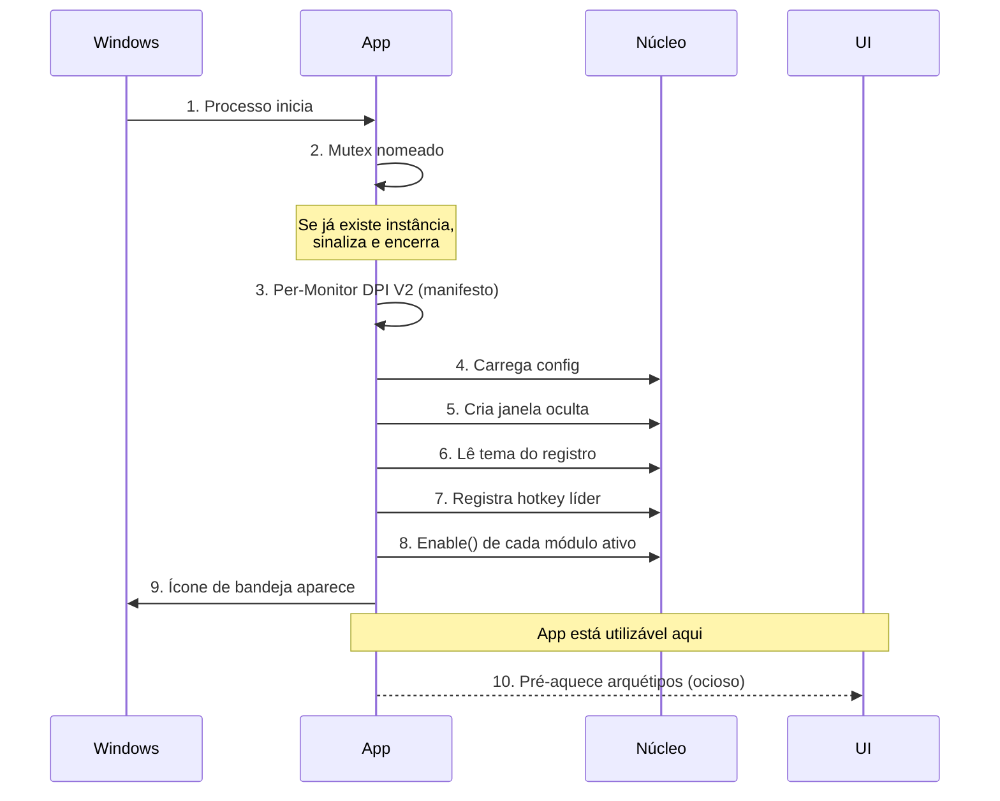
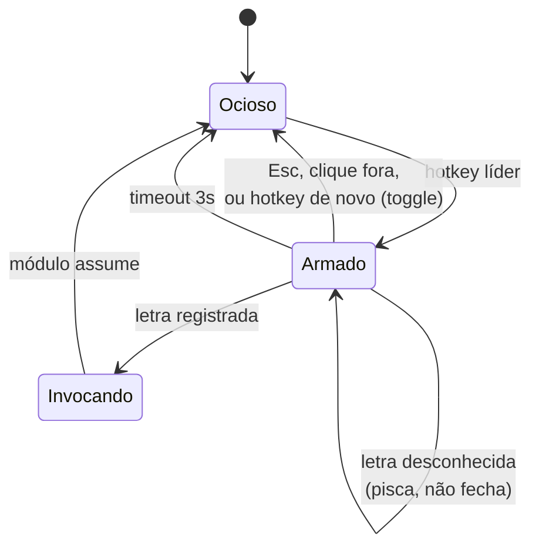

# Moductus — System Design

> Documento de arquitetura. O que o produto é e por que existe está em [PRODUCT.md](PRODUCT.md); aqui está **como ele funciona por dentro**.
>
> **Status:** fase 1 em andamento. Implementados: 5.1 (instância única), 5.2 (janela oculta), 5.3 (hotkeys), 5.7 (configuração), a bandeja da 5.8 sem o mecanismo de reivindicação, 5.9 (tema), 6.4 (tokens) e o autostart. O restante descreve o desenho pretendido, não o que existe.

## Sumário

1. [O que este documento decide](#1-o-que-este-documento-decide)
2. [Visão geral](#2-visão-geral)
3. [Camadas e regra de dependência](#3-camadas-e-regra-de-dependência)
4. [Ciclo de vida do processo](#4-ciclo-de-vida-do-processo)
5. [Serviços do núcleo](#5-serviços-do-núcleo)
6. [A camada de UI](#6-a-camada-de-ui)
7. [Módulos](#7-módulos)
8. [Interop com o Windows](#8-interop-com-o-windows)
9. [Threading e orçamento de latência](#9-threading-e-orçamento-de-latência)
10. [Erros e diagnóstico](#10-erros-e-diagnóstico)
11. [Testabilidade](#11-testabilidade)
12. [Decisões em aberto](#12-decisões-em-aberto)

---

## 1. O que este documento decide

Três problemas concentram quase todo o risco técnico deste projeto. Se eles estiverem bem resolvidos, o resto é preenchimento.

**Capturar a tecla líder sem instalar um hook global.** Hook de teclado de baixo nível é a solução óbvia e a errada: é o que faz anti-cheat de jogo marcar o processo e antivírus levantar suspeita, num app que vende auditabilidade como argumento.

**Aparecer em menos de 140ms, sempre, inclusive na primeira vez.** O WPF cobra a construção da árvore visual na primeira exibição de cada janela. Se essa conta cair na primeira invocação de cada módulo, o produto quebra a própria promessa doze vezes.

**Devolver o foco para onde ele estava.** Um overlay que rouba foco e não devolve corretamente é pior que não ter overlay, porque interrompe o trabalho em vez de acelerá-lo.

O restante do documento existe em função dessas três.

---

## 2. Visão geral

Um processo, uma thread de UI, uma janela oculta que recebe as mensagens do Windows, e quatro janelas de superfície que aparecem e somem.

```
┌─────────────────────────────────────────────────────────────┐
│  Processo Moductus (uma thread de UI)                       │
│                                                             │
│  ┌───────────────┐                                          │
│  │ Janela oculta │◄──── WM_HOTKEY, WM_SETTINGCHANGE,        │
│  │ (message-only)│      WM_DPICHANGED, mensagem de          │
│  └───────┬───────┘      segunda instância                   │
│          │                                                  │
│          ▼                                                  │
│  ┌────────────────────────────────────────────┐             │
│  │ Núcleo                                     │             │
│  │  HotkeyRegistry  LeaderRouter  ConfigStore │             │
│  │  ThemeWatcher    TrayHost      ModuleCatalog│            │
│  └────────────────────┬───────────────────────┘             │
│                       │                                     │
│         ┌─────────────┼─────────────┐                       │
│         ▼             ▼             ▼                       │
│  ┌────────────┐ ┌──────────┐ ┌───────────────┐              │
│  │ Leader     │ │ Módulos  │ │ 4 arquétipos  │              │
│  │ Overlay    │ │ (12)     │ │ pré-criados   │              │
│  └────────────┘ └──────────┘ └───────────────┘              │
└─────────────────────────────────────────────────────────────┘
             │
             ▼
   Ícone de bandeja — a única superfície permanente
```

Nada aqui é assíncrono por padrão. O app passa quase todo o tempo ocioso, esperando uma mensagem do Windows.

---

## 3. Camadas e regra de dependência

| Projeto | Responsabilidade | Pode referenciar |
|---|---|---|
| `Moductus.App` | Entry point, composição, bandeja, ciclo de vida | Core, UI, Modules |
| `Moductus.UI` | Tokens, tema, os quatro arquétipos, LeaderOverlay | Core |
| `Moductus.Core` | Hotkeys, líder, config, interop, contrato de módulo | — |
| `Moductus.Modules` | Os doze módulos | Core, UI |
| `Moductus.Core.Tests` | Testes do núcleo | Core |

A regra é uma só: **as setas nunca apontam para dentro de `Modules`**. Nenhum módulo é conhecido pelo núcleo ou pela UI. O `ModuleCatalog` em `App` é o único lugar que sabe que os doze existem.

`Moductus.Core` **referencia WPF** e assume isso ([decisão 14](PRODUCT.md#10-decisões-registradas)). Não é uma biblioteca portável; é a base de um app Windows. Fingir independência de UI custaria uma camada de abstração declarativa que o primeiro módulo com configuração incomum quebraria.

---

## 4. Ciclo de vida do processo

A ordem importa: cada passo depende do anterior, e a latência percebida depende de o passo 8 não estar no caminho crítico.



**Passos 1 a 9 são o caminho crítico**, e o orçamento inteiro é de **300ms até o ícone da bandeja aparecer**. Nada de I/O grande, nenhuma varredura de assembly, nenhuma construção de janela.

**O passo 10 acontece fora do caminho crítico**, agendado no `Dispatcher` em prioridade `ApplicationIdle`. É aí que as quatro janelas de arquétipo são construídas e mantidas ocultas. Isso resolve o segundo dos três problemas do capítulo 1 sem pagar por ele no startup: quando o usuário aperta a primeira hotkey — sempre segundos depois de o app subir — a árvore visual já existe.

### Encerramento

`Disable()` em cada módulo ativo, `UnregisterHotKey` de tudo, flush da config se houver escrita pendente, e o mutex é liberado. Sem diálogo, sem confirmação.

---

## 5. Serviços do núcleo

### 5.1 Instância única

Mutex nomeado global criado antes de qualquer outra coisa. Se a criação indicar que já existe dono, a instância nova **não apenas encerra**: ela envia uma mensagem para a janela oculta da instância existente, que abre a janela de configurações e traz para frente.

Isso importa porque o modo de falha silencioso é o pior possível. Sem isso, a segunda instância falharia em registrar toda hotkey — `RegisterHotKey` retorna `false` — e o usuário ficaria com um Moductus visivelmente rodando e completamente inerte, sem nenhuma pista do motivo.

### 5.2 A janela oculta

Uma única janela top-level **nunca exibida** — `WS_POPUP` sem `WS_VISIBLE`, com `WS_EX_TOOLWINDOW` para ficar fora do Alt+Tab — criada via `HwndSource`, é o alvo de todas as mensagens do Windows que interessam ao app.

**Não é `HWND_MESSAGE`, e a primeira versão deste documento errou nisso.** Janela message-only não recebe broadcast, e dois itens da tabela abaixo são broadcast: `WM_SETTINGCHANGE` e `TaskbarCreated`. Com `HWND_MESSAGE` o tema nunca acompanharia o sistema e o ícone nunca voltaria depois de o Explorer reiniciar — e nenhum dos dois falha de forma visível; eles simplesmente não acontecem.

| Mensagem | Quem consome |
|---|---|
| `WM_HOTKEY` | `HotkeyRegistry` |
| `WM_APP+1` | `TrayIcon` — clique no ícone de bandeja |
| `TaskbarCreated` (registrada) | `TrayIcon` — o Explorer reiniciou, re-adiciona o ícone |
| `Moductus.Activate` (registrada) | Segunda instância pedindo ativação |
| `WM_SETTINGCHANGE` | `ThemeWatcher` (claro/escuro, alto contraste) |
| `WM_DPICHANGED` | Posicionamento dos arquétipos |

Ela expõe um único ponto de assinatura, `AddHandler`, e cada consumidor filtra o que lhe interessa. É também a única classe que sabe o que é um `HWND` fora do Core: o `Moductus.App` não referencia o CsWin32 e não tem uma linha de Win32 — a conversão acontece na borda, uma vez.

Ela não é visível, não aparece no Alt+Tab e não tem superfície. É infraestrutura pura.

### 5.3 Registro de hotkeys

`RegisterHotKey` tem duas características que definem o desenho: ele **falha retornando `false`** quando outro processo já tomou a combinação, e não diz qual processo foi.

O `HotkeyRegistry` centraliza todo registro e guarda o resultado de cada tentativa. Registro que falha **não é silencioso**: fica marcado como em conflito, o ícone de bandeja mostra o estado, e a janela de configurações lista a combinação com o motivo. Um atalho que "não funciona" sem explicação é o modo de falha mais caro deste tipo de app, e é exatamente o que a tecla líder existe para minimizar.

Por padrão há **uma** hotkey registrada: `Ctrl+Alt+Space`. Atalhos diretos por módulo existem, mas são opt-in.

```csharp
public interface IHotkeyRegistry
{
    HotkeyRegistration Register(HotkeyBinding binding, Action callback);
    void Unregister(HotkeyId id);
    IReadOnlyList<HotkeyRegistration> All { get; }   // inclui as em conflito
}
```

### 5.4 A máquina de estados da tecla líder

Este é o primeiro dos três problemas do capítulo 1, e a solução é deliberadamente chata: **nenhum hook global de teclado.**

Quando a hotkey líder dispara, o `LeaderOverlay` — uma janela WPF comum — é exibido **e recebe foco**. A partir daí, capturar a próxima tecla é apenas `KeyDown` numa janela focada, que é a coisa mais banal do WPF. Não há hook, não há filtro de mensagem de baixo nível, e nada que faça anti-cheat ou antivírus levantar a sobrancelha.



Três detalhes que não são óbvios:

**O timeout existe e é curto.** Se a pessoa aperta o líder e é interrompida, o overlay não pode ficar segurando o foco indefinidamente. Três segundos, e ele devolve o foco e some.

**Letra desconhecida não fecha o overlay.** Fechar puniria o erro de digitação com a perda do estado inteiro. O overlay pisca e continua armado.

**O foco volta antes de o módulo aparecer.** O `LeaderOverlay` restaura o `HWND` anterior *antes* de chamar `Invoke()`. Módulos de arquétipo HUD e Panel não roubam foco, então o usuário continua digitando no app onde estava. Se o módulo é uma Palette, ele mesmo captura o foco em seguida — mas partindo de um estado limpo.

### 5.5 Restauração de foco

Segundo problema do capítulo 1, e a parte com mais armadilha.

Antes de exibir qualquer superfície que roube foco, o app guarda o `HWND` retornado por `GetForegroundWindow`. Ao fechar, chama `SetForegroundWindow` nesse handle.

O Windows **bloqueia** mudança de foreground vinda de processo que não é o foreground atual, e o contorno tradicional é `AttachThreadInput`. Aqui isso não é necessário: no momento do fechamento, o Moductus **é** a janela em foreground, então tem o direito de passar o foco adiante. Essa é a razão de a restauração acontecer no fechamento e não em qualquer outro momento.

O handle guardado pode ter morrido enquanto o overlay estava aberto. Verificar com `IsWindow` antes de restaurar; se morreu, não fazer nada e deixar o Windows decidir.

### 5.6 Registro de letras

Mesma mecânica do registro de hotkeys, e pela mesma razão: **três módulos disputam o `p`** (Peek, Ports, Palette).

A letra é dado explícito no `ModuleCatalog`, não derivada da inicial. O usuário pode trocar pela configuração. Colisão é detectada no startup e reportada da mesma forma que conflito de hotkey — visível, não silenciosa.

A diferença em relação às hotkeys é que aqui a resolução é local: o app é dono do namespace inteiro de letras e sabe exatamente quem colide com quem, então dá para resolver de forma determinística e avisar.

### 5.7 Configuração

Um arquivo JSON, dois modos de localização:

| Modo | Caminho | Detecção |
|---|---|---|
| Instalado | `%APPDATA%\Moductus\config.json` | padrão |
| Portable | ao lado do executável | existe `portable.txt` |

Três propriedades não negociáveis:

**Versionado.** Campo `version` desde o primeiro release, com migração explícita entre versões.

**Chave desconhecida é preservada.** Isso tem consequência direta de implementação: a config **não pode** ser desserializada para um POCO e reserializada, porque isso apaga tudo que o POCO não conhece. A leitura vai para um `JsonNode`, o app opera sobre a árvore, e a escrita preserva o que não reconheceu. Sem isso, abrir uma versão antiga depois de testar uma nova destrói silenciosamente a configuração de quem colaborou testando.

**Escrita atômica.** Grava em arquivo temporário e usa `File.Replace`. Config corrompida por crash no meio da escrita transforma um app de conveniência num app que a pessoa desinstala.

Módulos guardam seu estado sob `modules.<id>`, e não enxergam a raiz.

### 5.8 O ícone de bandeja como superfície compartilhada

O documento de produto pede que **dois** módulos desenhem no ícone: o Timer pinta o progresso do pomodoro, e o Mic troca o ícone inteiro quando o microfone está mudo. Isso torna a bandeja um recurso disputado, e disputa sem regra vira bug.

O `TrayHost` é dono do ícone e aceita *sobreposições* de módulos por prioridade:

- A **base** é o mark do Moductus, com variante clara e escura conforme `SystemUsesLightTheme`.
- Um módulo pode reivindicar a bandeja enquanto tem estado ativo a comunicar.
- Se dois reivindicam ao mesmo tempo, vence a prioridade mais alta; o outro fica registrado e assume quando o primeiro liberar.
- O ícone volta à base quando ninguém reivindica.

E a armadilha de DPI: **a bandeja pede o ícone em 16, 20, 24 ou 32px conforme o scaling do monitor.** Gerar o bitmap no tamanho solicitado, nunca fixo em 16 e escalado — o resultado escalado fica borrado exatamente no ativo visual mais visível do produto.

### 5.9 Tema

Lê `AppsUseLightTheme` do registro no startup e escuta `WM_SETTINGCHANGE` para reagir em tempo real.

Três estados, não dois: **claro**, **escuro** e **alto contraste**. Quando o alto contraste do Windows está ativo, os tokens são ignorados e as cores do sistema assumem — usar a paleta própria nesse modo é anular a acessibilidade que o usuário pediu explicitamente.

Também lê `SystemParametersInfo(SPI_GETCLIENTAREAANIMATION)`: com animações desativadas na acessibilidade, toda transição vai a zero.

---

## 6. A camada de UI

### 6.1 Ciclo de vida das janelas

As quatro janelas de arquétipo são **singletons, construídas uma vez em tempo ocioso e nunca destruídas**. Mostrar é `Show()`, fechar é `Hide()`.

Essa é a resposta ao segundo problema do capítulo 1. A alternativa — construir no `Invoke()` — colocaria a construção da árvore visual do WPF dentro do orçamento de 140ms, e ela não cabe lá na primeira vez.

O custo é memória ocupada por janelas ocultas. É aceitável dentro do alvo de 40 a 80 MB porque são quatro janelas vazias, não doze janelas cheias: **o conteúdo é que troca**, injetado pelo módulo que está invocando.

Um efeito colateral que precisa de disciplina: janela reutilizada carrega estado do uso anterior. Todo arquétipo limpa seu conteúdo ao ser ocultado, não ao ser exibido — limpar na exibição gastaria tempo dentro do orçamento.

### 6.2 Os quatro arquétipos

| Arquétipo | Posição | Foco | Estilo de janela |
|---|---|---|---|
| **Palette** | Centro, terço superior, 640px | Rouba, devolve ao fechar | Normal, topmost |
| **HUD** | Pílula ancorada | Nunca | `WS_EX_NOACTIVATE` |
| **Panel** | Flutuante, redimensionável | Nunca | `WS_EX_NOACTIVATE` |
| **Canvas** | Tela cheia | Rouba | Borderless, topmost |

`WS_EX_NOACTIVATE` é aplicado via `HwndSourceHook` no `SourceInitialized`, antes da primeira exibição.

O **Canvas** merece nota: ele não é uma janela transparente sobre o desktop ao vivo. Ele captura o desktop como bitmap com `BitBlt`, exibe esse bitmap numa janela fullscreen borderless topmost, e todas as ferramentas — régua, lupa, conta-gotas, OCR — operam sobre o bitmap em memória. Isso deixa a medição precisa e independente do que estava se movendo na tela no instante da captura.

### 6.3 DPI e posicionamento

**Per-Monitor DPI Awareness V2 declarado no manifesto**, não em código. Sem isso, overlay em monitor secundário sai borrado ou fora de lugar, e o bug aparece só na máquina de quem tem dois monitores com escalas diferentes.

Superfície aparece no monitor da janela em foreground, não no primário. O Win32 fala em pixels físicos e o WPF em DIPs; a conversão acontece na borda entre as camadas, uma vez, e nunca espalhada pelo código de módulo.

### 6.4 Tokens

`Tokens.xaml` é um `ResourceDictionary` único, e é a **fonte única de cor, tamanho, raio e duração**. Nenhum literal visual em código de módulo, sem exceção.

Isso não é preciosismo de estilo: é o que permite que doze módulos escritos em momentos diferentes pareçam o mesmo produto, e o que impede que geração assistida invente uma cor a cada arquivo.

---

## 7. Módulos

### 7.1 O contrato

```csharp
public interface IModule
{
    string Id { get; }                  // "ports"
    string Name { get; }                // "Ports"
    string Description { get; }
    ModuleArchetype Archetype { get; }

    char SuggestedLeaderKey { get; }
    bool HasSurface { get; }            // false em módulo puro de estado

    void Enable();                      // barato. Startup.
    void Disable();
    void Invoke();                      // mostra a superfície. Atalho.

    UserControl? BuildSettings();
}
```

**`Enable` e `Invoke` são separados e isso é a regra mais fácil de violar.**

`Enable` roda para todo módulo ativo durante o startup, dentro do orçamento de 300ms. Ele registra letra e hotkey, e nada mais: sem UI, sem I/O, sem consulta ao sistema.

`Invoke` roda no atalho e é o único lugar onde a superfície aparece.

Juntar os dois faz o startup carregar a UI de todos os módulos ativos. É assim que um app de bandeja começa a demorar três segundos para subir, e a degradação é gradual — chega junto com o oitavo módulo, quando ninguém está mais olhando para o startup.

### 7.2 Catálogo e composição

Registro **manual e explícito** no `ModuleCatalog`, dentro de `Moductus.App`. Sem varredura de assembly, sem reflection, sem atributo mágico.

Duas razões: a lista completa de módulos cabe num arquivo que dá para ler de uma vez, e reflection no startup custa tempo dentro do orçamento crítico. Como não há plugins de terceiros ([decisão 4](PRODUCT.md#10-decisões-registradas)), a flexibilidade que a reflection compraria não tem comprador.

Um único projeto `Moductus.Modules` com uma pasta por módulo, não um projeto por módulo. Sem carregamento dinâmico, assembly separada só compra tempo de build.

### 7.3 Estado do módulo

Módulo não guarda estado em campo estático nem em arquivo próprio. Ele recebe um escopo de configuração sob `modules.<id>` e escreve ali. Isso mantém a config em um arquivo só — o que o modo portable exige — e faz o backup e a migração serem um problema resolvido uma vez.

---

## 8. Interop com o Windows

**`Microsoft.Windows.CsWin32` é obrigatório para todo P/Invoke.** O nome exato da função vai no `NativeMethods.txt` e o gerador escreve a assinatura.

Assinatura de struct escrita à mão é a fonte de bug mais cara deste tipo de projeto: compila, roda, passa no teste, e corrompe memória numa versão específica do Windows. É também o erro que geração assistida comete com mais frequência, o que torna o CsWin32 uma decisão de arquitetura e não de conveniência.

As APIs principais por área:

| Área | API |
|---|---|
| Hotkeys | `RegisterHotKey`, `UnregisterHotKey` |
| Foco | `GetForegroundWindow`, `SetForegroundWindow`, `IsWindow` |
| Estilo de janela | `GetWindowLong`, `SetWindowLong` (`WS_EX_NOACTIVATE`) |
| Bandeja | `Shell_NotifyIcon`, `RegisterWindowMessage` |
| Tema | `DwmSetWindowAttribute` (Mica e Acrylic) |
| Captura | `BitBlt` |
| Acessibilidade | `SystemParametersInfo` |

### A bandeja é chamada direto, sem WinForms

O WPF não tem API de ícone de bandeja, e o caminho fácil seria trazer o `NotifyIcon` do WinForms só para isso. O spike mediu o preço e ele não compensa: com os dois stacks no mesmo projeto, quase todo nome de UI fica ambíguo — `Application`, `TextBox`, `ListBox`, `Orientation`, `Color`, `Brushes` — e cada arquivo que toca interface precisa de uma lista de aliases. Isso incluiria os doze módulos, para sempre.

Então `Shell_NotifyIcon` é chamado direto pelo CsWin32, e a janela oculta da seção 5.2 recebe o callback. **Isso não é de graça**, e o wrapper do WinForms escondia exatamente duas coisas que agora são responsabilidade nossa:

**O Explorer reinicia e leva o ícone junto.** Quando isso acontece, o Windows transmite a mensagem registrada `TaskbarCreated`, e cabe ao app re-adicionar o ícone. Sem tratar isso, o Moductus continua rodando com a única superfície permanente do produto invisível — e o usuário conclui que ele morreu. É o bug clássico desta API e ele só aparece em máquina real, meses depois.

**Menu de contexto exige a dança do foreground.** Antes de exibir o menu é preciso chamar `SetForegroundWindow` na janela dona; sem isso o menu não fecha ao clicar fora e fica preso na tela. O menu em si pode ser um `ContextMenu` do WPF posicionado no cursor, o que mantém o visual dentro dos tokens em vez de usar o menu nativo do Win32.

Em compensação, a geração do ícone fica mais simples, não mais complexa: o Timer e o Mic já exigem desenhar bitmap próprio no tamanho que a bandeja pedir (16, 20, 24 ou 32px conforme o scaling), então o wrapper não estava poupando esse trabalho de qualquer forma.

---

## 9. Threading e orçamento de latência

**Uma thread de UI, e é onde quase tudo acontece.** O app fica ocioso a maior parte do tempo.

A regra para módulos: **`Invoke()` retorna rápido.** Trabalho que pode demorar — enumerar a tabela TCP, capturar a tela, rodar OCR — vai para `Task.Run` e volta pela `Dispatcher`. A superfície aparece imediatamente com estado de carregamento; ela nunca espera o dado para aparecer.

Orçamentos, do documento de produto:

| Evento | Orçamento |
|---|---|
| Startup até o ícone de bandeja | 300ms |
| Hotkey até superfície visível | 140ms |
| Transição de saída | 90ms |
| Hover e press | 80ms |

O de 140ms é o que define o produto. **Aparecer sem animação é preferível a aparecer bonito e atrasado** — se a estética custar o orçamento, a estética cede.

### Medições

Os números acima deixaram de ser premissa. Um spike descartável mediu o caminho real: WPF em .NET 10, build Release, framework-dependent, janela representativa com input de 36px e lista de 50 linhas.

| O que | Medido | Orçamento | |
|---|---|---|---|
| Processo até ícone de bandeja | **193–208 ms** | 300 ms | dentro |
| Idem, primeira execução após instalar | **~808 ms** | 300 ms | estourou |
| Processo frio até pixels da primeira janela | **680–686 ms** | 440 ms | estourou |
| Janela nova, processo já quente | **4,4 ms** | 140 ms | dentro |
| Janela reutilizada, processo já quente | **8,1 ms** | 140 ms | dentro |

Três leituras, e a segunda é a que justifica metade deste documento.

**O orçamento de startup se sustenta, menos na primeira vez.** Em execução normal o ícone aparece em torno de 195ms, com o runtime .NET custando ~90ms e o WPF mais ~70ms. Na primeiríssima execução depois de instalar, com cache de disco frio, isso vai a ~808ms. Não é corrigível por código, e é exatamente o momento em que a pessoa está formando a primeira impressão.

**A primeira janela de um processo custa ~490 ms.** É a diferença entre os 685ms até os pixels e os 195ms até a bandeja. Sozinha, ela estouraria o orçamento de invocação em 3,5 vezes.

**Depois que o WPF está de pé, o custo desaba para menos de 10 ms** — cerca de 20 vezes abaixo do orçamento.

### O que isso corrige no desenho

O pré-aquecimento estava certo, mas a razão registrada estava imprecisa. **O custo de ~490ms é do framework WPF subindo, não da construção de cada janela.** Depois que a primeira janela renderiza, uma janela *nova* custa 4,4ms — praticamente o mesmo que reutilizar uma existente.

Duas consequências:

**Uma janela pré-aquecida já paga por todas.** Não é preciso exibir e esconder os quatro arquétipos para ganhar a latência; o primeiro deles paga o custo do framework e os outros três ficam em alguns milissegundos. Manter os quatro como singletons continua valendo pelo estado e pela simplicidade, mas não é mais um requisito de performance.

**Reutilizar não é mais rápido que criar.** A diferença medida entre 8,1ms e 4,4ms está dentro da resolução da métrica — o proxy usado é ligado ao tick de frame do WPF, que tem granularidade de ~16ms — então não dá para concluir que uma seja melhor que a outra. O que dá para afirmar é que **as duas cabem no orçamento com folga de uma ordem de grandeza**, e que a escolha entre elas pode ser feita por clareza de código em vez de por velocidade.

### O que o spike validou de interop

- `RegisterHotKey` via CsWin32 funcionou sem ajuste manual de assinatura
- **Detecção de conflito funciona**: registrar a mesma combinação duas vezes é recusado pelo Windows, que é a base do registro central da seção 5.3
- `WS_EX_NOACTIVATE` preservou o foco — a janela apareceu sem tirar o foreground de quem o tinha

---

## 10. Erros e diagnóstico

**Nenhum `MessageBox`, em lugar nenhum.** Erro aparece inline, dentro da superfície do próprio módulo, com texto que diz o que aconteceu.

O caso mais comum é previsível e merece tratamento explícito em vez de mensagem genérica: **o Ports não consegue ver o processo dono de portas de serviço do sistema sem elevação.** Isso aparece na interface como "requer elevação", não como linha vazia nem como erro. Esconder limitação gera mais desconfiança que admiti-la.

Log em arquivo, rotativo, ao lado da config. Sem envio, sem telemetria, sem coleta — o log existe para a pessoa anexar num issue, e essa é a única forma de ele sair da máquina dela.

---

## 11. Testabilidade

O escopo de teste é estreito de propósito, e o desenho tem que cooperar para que ele funcione.

**Testado:** conflito de hotkey, colisão de letra, roteamento da máquina de estados do líder, portable versus instalado, migração de schema e preservação de chave desconhecida.

**Não testado:** UI e interop. Ambos exigem sessão gráfica real, e o custo de manutenção supera o retorno.

Isso só é possível porque **o núcleo depende de interfaces finas sobre o Win32, não das funções diretamente**. O `HotkeyRegistry` fala com um `IHotkeySink` cuja implementação real chama `RegisterHotKey` e cuja implementação de teste responde o que o teste mandar.

O que se testa é a **lógica de conflito** — dois módulos pedindo a mesma combinação, o segundo sendo marcado corretamente, o estado ficando visível. Não se testa se `RegisterHotKey` funciona; isso é problema da Microsoft.

Sem essa fina camada de indireção, a decisão "testa só o Core" seria vazia, porque não haveria nada testável dentro dele.

---

## 12. Decisões em aberto

Pontos que este documento **não** resolve, e que precisam de decisão antes ou durante a Fase 1:

| # | Questão | Por que ainda está aberta |
|---|---|---|
| 1 | **O mark** | O keycap foi escolhido quando o produto se chamava Tecla, e não deriva mais do nome. Bloqueia o desenho dos 16px, que a seção 7 do PRODUCT.md chama de ativo mais importante da identidade. |
| 2 | **Prioridade na bandeja** | Timer e Mic podem reivindicar o ícone ao mesmo tempo. A regra de prioridade está desenhada mas os valores não foram atribuídos. |
| 3 | **Timeout do líder** | Três segundos é chute fundamentado, não medição. Precisa de uso real para calibrar. |
| 4 | **Persistência de posição do Panel** | Panel é redimensionável e fixável. Se a posição persiste, o que acontece quando o monitor onde ele estava deixa de existir? |

O autostart, que constava aqui, foi decidido: chave `Run` — decisão 21 do PRODUCT.md, com a razão de ler `StartupApproved` documentada em `Autostart.cs`.

---

## Referências internas

- [PRODUCT.md](PRODUCT.md) — o que é e por que existe, com as 20 decisões registradas
- [MODULES.md](MODULES.md) — como escrever um módulo
- [CONTRIBUTING.md](../CONTRIBUTING.md) — regras não negociáveis de PR
